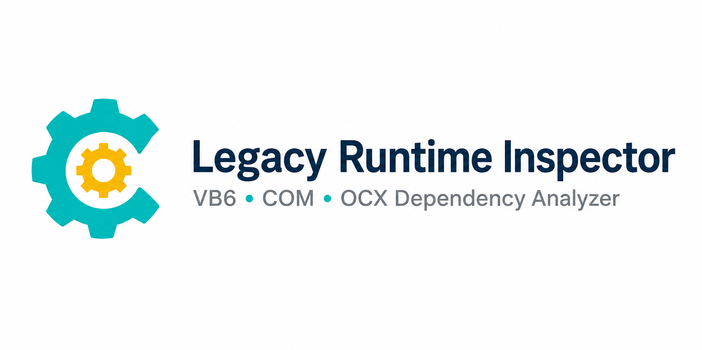
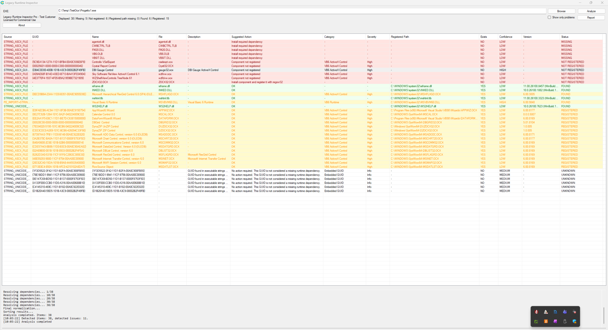
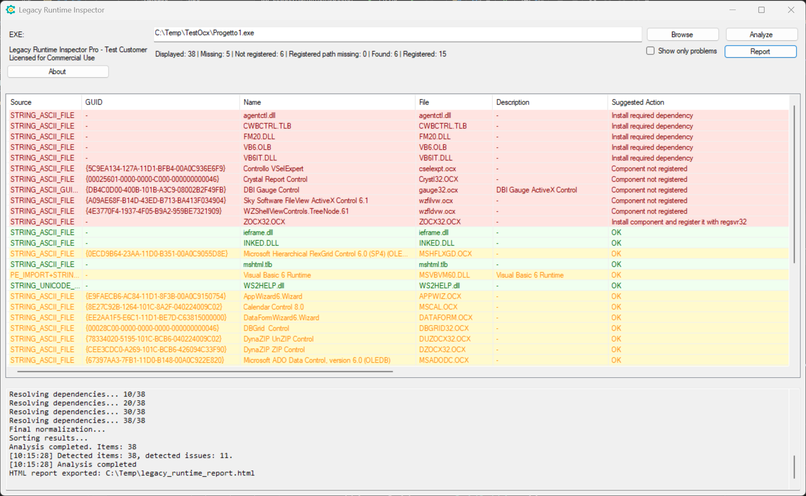
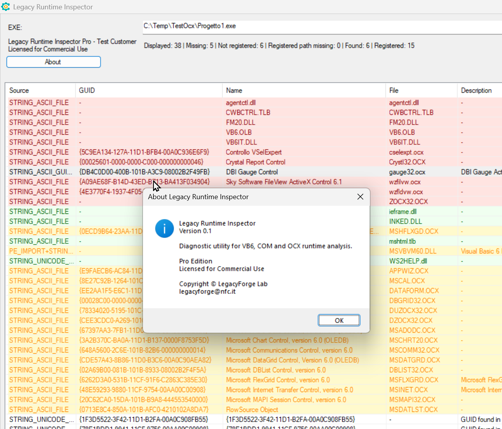
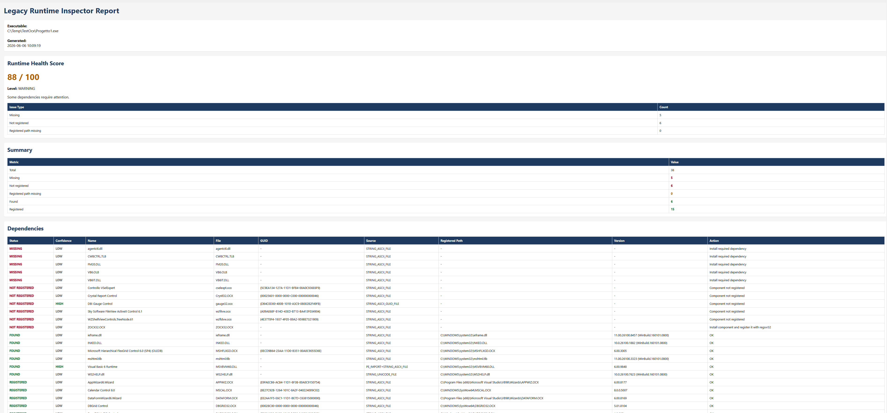

  

Diagnostic utility for VB6, COM and ActiveX runtime analysis

## Why

Legacy Runtime Inspector was designed to help maintainers of legacy Windows applications quickly identify missing runtime dependencies, COM registration issues and ActiveX components.

It is particularly useful for:

- VB6 applications
- COM-based applications
- Industrial software
- Legacy business applications
 
## Features

- Missing DLL detection
- Missing OCX detection
- COM registration verification
- Embedded COM GUID analysis
- ActiveX dependency detection
- Runtime Knowledge Base integration
- Portable deployment

---

## Main Analysis Window

---

## Missing Components Detection

---

## HTML Report

---

## About

---

## Editions

### Free Edition

- Full analysis
- Personal use
- Evaluation use

### Pro Edition

- Commercial use
- HTML/TXT export
- Priority support
- Knowledge Base updates

---

## Download

Download the latest version from the Releases section.

---

## Contact

legacyforge@nfc.it

---

Copyright © NFC LegacyForge Lab - 1998/2006
